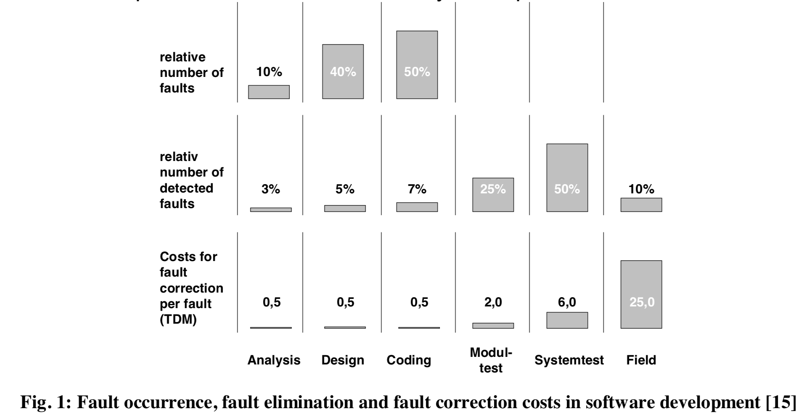

## 简介

FMEA, Failure Mode and Effect Analysis 一直广泛使用于硬件设计中，通过建模来避免现场出问题。之后，软件领域借鉴此经验，将该方法引入进来，用来解决软件领域的类似问题。软件领域有其特殊性，人为错误占了软件问题的一大部分。

图1说明了软件不同阶段中能够发现的缺陷数目和代价，可以看到，问题发现得越早，其修复的代价也就就小，问题的大规模发现主要集中在coding和两个测试阶段。在现场能够发现的问题是很少的，然而其分析和修复的代价却是相当得高。也正因为如此，发希望将更多的问题，特别是设计方面的问题，提前发现得越早越好。

也正因为如此，才在软件领域引入了FMEA方法。对于此方法的使用，建议如下（不建议将此方法应用于软件的实现过程中）：

1. 系统设计过程中使用
2. 软件设计过程中使用，用于识别关键模块或组件
3. 组件设计过程中使用，用于识别主要功能和关键函数

## FMEA的关键要素和步骤

fmea是一个组织或团队的行为，一般通过会议（人数不宜太多）的形式来进行。一般过程主要包括：

1. Define Failure Modes – What can go wrong here? 
2. Define Effects – What will happen then? 
3. Describe Targets – Who will suffer from the failure? 
4. Find Root Causes – Why will that happen? 
5. Prioritize the Risks – What is the likelihood? 
6. Define Solution Actions – How can this be prevented? 
7. Define Current Prevention and Detection Methods – What is currently being done? 

整个过程可以使用excel类似软件进行记录，对上面各个方面进行详细地记录。

第一步，定义失效模式（Failure Mode），将结果写在失效模式列中。所谓失效模式，主要是指对象会发生什么预料之外的问题或行为。回答此问题时，要求是对象**直接发生的**行为。

第二步，回答引起的直接影响（Effects）或后果。同样，在这一步也是回答失效模式带来的**直接后果**。

第三步，从**使用角度**来回答谁会承受什么样的结果。这一步更多地从用户（可能是其他组件、系统使用者）的立场来说明他看到的后果或者影响是什么。

第四步，回答该失效模式的根因。这个根因要尽量避免是不可改进的、无操作措施的原因。

第五步，评估该问题的风险性（可能性）。主要是从三个方面进行加权考虑：发生概率； 后果的严重度； 可探测概率。 这三个因素的评估使用分档打分制进行，最后可以使用加权的方法给出每一个失效模式的分数，以此来表明它的风险性。

第六步，给出解决方法，以便防止此问题的发生。

第七步，给出当前对此问题的探测方法和防御方法。说明此时已经采取过了哪些措施，对于未采取措施的问题要进行遗留说明。

对上面的七个步骤进行重复，使得所有的失效模式都得以覆盖、分析和考虑。软件领域使用此方法要注意其本身的特殊性，即其运行时引入的动态性带来了问题分析的复杂性。对于这一点，最直接的方法是分而治之，即将软件系统自顶向下地进行拆解后，再进行分析。也正是因为如此，FTA(故障树分析方法)和FMEA方法才会经常结合起来使用，前者是自顶向下地推演，后者是自底向上的分析。

## 参考

1. Using FMEA to Improve Software Reliability 
2. Software FMEA  Opportunities and benefits of FMEA in the development process of software-intensive technical systems 