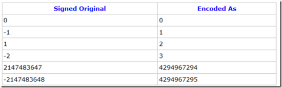

原文件地址： http://www.tuicool.com/articles/2iAJjeV

LevelDB内部通过采用变长编码，对数据进行压缩来减少存储空间，采用CRC进行数据正确性校验。下面就对varint编码进行学习。

传统的integer是以32位来表示的，存储需要4个字节，当如果整数大小在256以内，那么只需要用一个字节就可以存储这个整数，这样就可以节省3个字节的存储空间，Google varint就是根据这种思想来序列化整数的

无符号

Varint 是一种紧凑的表示数字的方法。它用一个或多个字节来表示一个数字，值越小的数字使用越少的字节数。这能减少用来表示数字的字节数。

Varint 中的每个 byte 的最高位 bit 有特殊的含义，如果该位为 1，表示后续的 byte 也是该数字的一部分，如果该位为 0，则结束。其他的 7 个 bit 都用来表示数字。因此小于 128 的数字都可以用一个 byte 表示。大于 128 的数字，会用两个字节。

例如整数1的表示，仅需一个字节：

例如300的表示，需要两个字节：

采用 Varint，对于很小的 int32 类型的数字，则可以用 1 个 byte 来表示。当然凡事都有好的也有不好的一面，采用 Varint 表示法，大的数字则需要 5 个 byte 来表示。从统计的角度来说，一般不会所有的消息中的数字都是大数，因此大多数情况下，采用 Varint 后，可以用更少的字节数来表示数字信息。

下图演示了 Google Protocol Buffer 如何解析两个 bytes。注意到最终计算前将两个 byte 的位置相互交换过一次，这是因为 Google Protocol Buffer 字节序采用 little-endian 的方式。

有符号

如果使用int32/int64表示一个负数，该字段的值无论是-1还是-2147483648，其编码后长度将始终为10个字节，就如同对待一个很大的无符号整型一样。反之，如果使用的是sint32/sint64，Protocol Buffer将会采用ZigZag编码方式，其编码后的结果将会更加高效。
这里简单讲述一下ZigZag编码，该编码会将有符号整型映射为无符号整型，以便绝对值较小的负数仍然可以有较小的varint编码值，如-1。下面是ZigZag对照表：

其公式为：
(n << 1) ^ (n >> 31) //sint32
(n << 1> ^ (n >> 63) //sint64
需要补充说明的是，Protocol Buffer在实现上述位移操作时均采用的算术位移，因此对于(n >> 31)和(n >> 63)而言，如果n为负值位移后的结果就是-1，否则就是0。
注：简单解释一下C语言中的算术位移和逻辑位移。他们的左移操作都是相同的，即低位补0，高位直接移除。不同的是右移操作，逻辑位移比较简单，高位全部补0。而算术位移则需要视当前值的符号位而定，补进的位和符号位相同，即正数全补0，负数全补1。换句话说，算术位移右移时要保证符号位的一致性。在C语言中，如果使用 int变量位移时就是算术位移，uint变量位移时是逻辑位移。
